# Bank Campaigns Project - Python Course AI Analysis

## Problem Statement from Module 17

This practical application assignment aims to compare the performance of various classifiers including k-nearest neighbors, logistic regression, decision trees, and support vector machines.

### Data

The dataset is sourced from the UCI [Machine Learning repository](https://archive.ics.uci.edu/ml/datasets/bank+marketing), comprising outcomes of multiple marketing campaigns conducted by a Portuguese banking institution.

### Deliverables

Our objective is to comprehend, prepare, and model the provided data. This entails creating a Jupyter Notebook containing a clear articulation of the business problem, precise interpretation of descriptive and inferential statistics, findings (including actionable insights), and recommendations for the next steps.

## Solution

- Key Features: The dataset encompasses demographic particulars such as age, occupation, marital status, and educational attainment. Additionally, it includes financial metrics like credit default status, homeownership, and loan status. Contact-related attributes such as the mode of contact, month, and day of the week of the call are also included.

- Further Insights: Moreover, the dataset encompasses information regarding call duration, frequency of contacts during campaigns, and details from previous contacts. Economic indicators such as employment variation rate, consumer price index, and consumer confidence index, alongside other financial metrics, are integrated.

- Target Variable: The target variable 'y' signifies whether the client subscribed to the term deposit ('yes') or not ('no'). The primary objective is to forecast the likelihood of a subscription based on the provided features.

### EDA(Exploratory Data Analysis) and Preprocessing

- There are 41188 rows of data with no null values.
- 12 duplicates exist in the data, which have been removed.
- The data exhibits a significant class imbalance, with just under 5000 accepted offers and over 35000 unaccepted offers.

### Visual Analysis

Various visualizations depict the distribution of accepted and rejected offers based on different factors like marital status, housing status, education, and job.

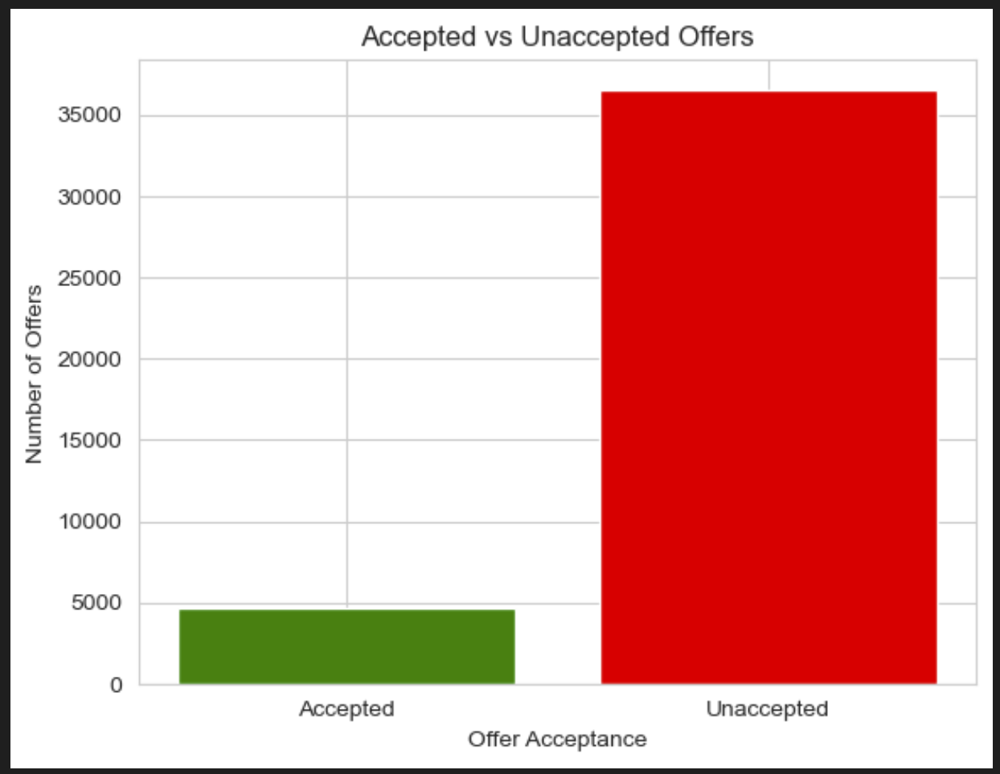

#### Offers Accepted vs rejected based on Marital Status

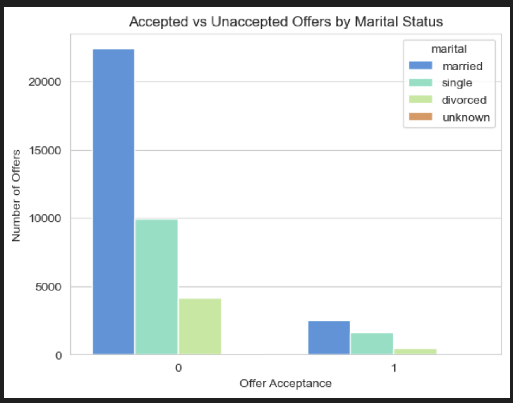

#### Accpted vs rejected WRT housing status

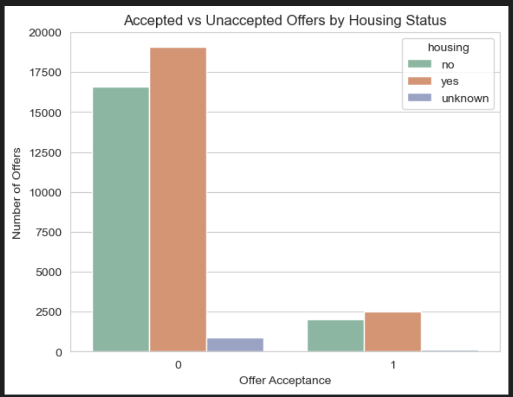

#### Offers accepted vs rejected by education and job

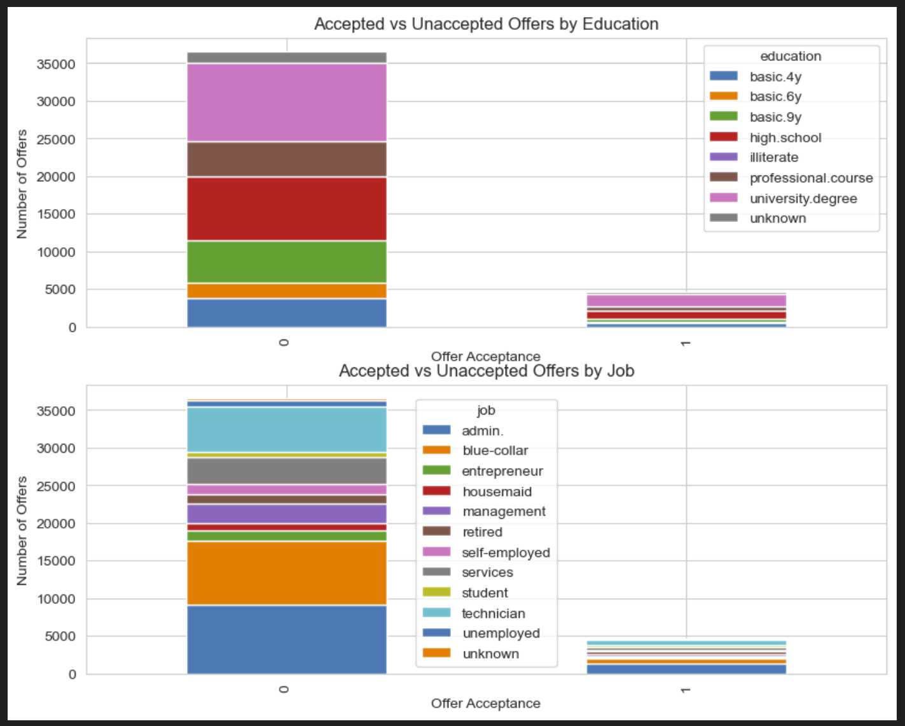

#### Classification of users who accepted offers by education

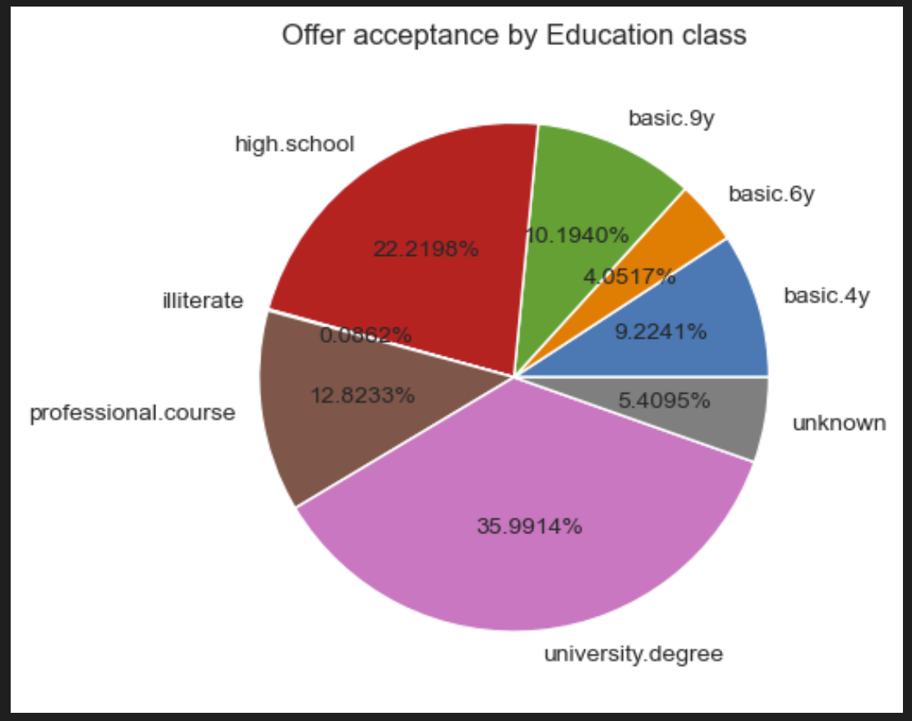
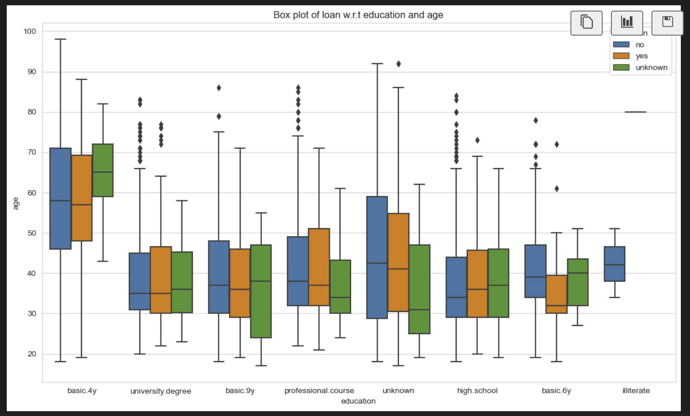

#### Classification of accepted offers by job

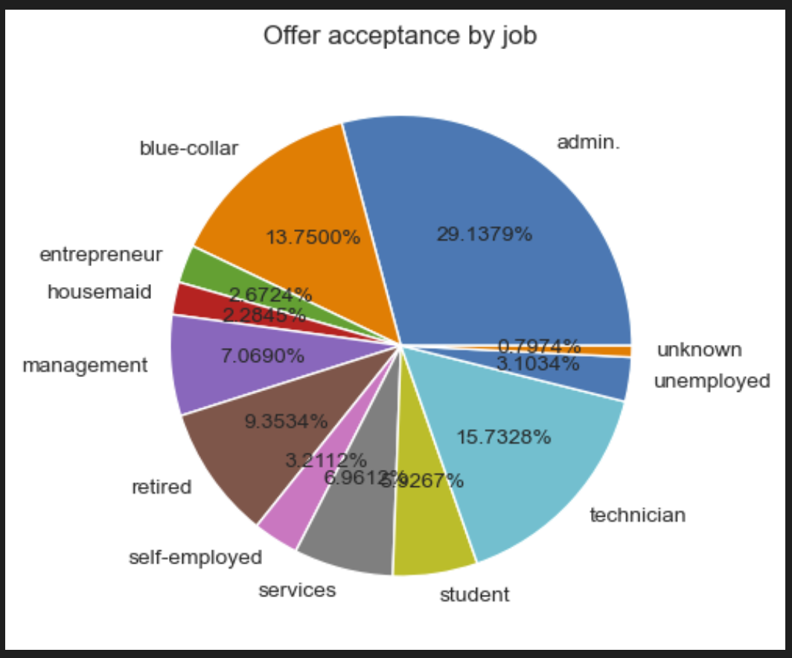

#### Duration Vs Target

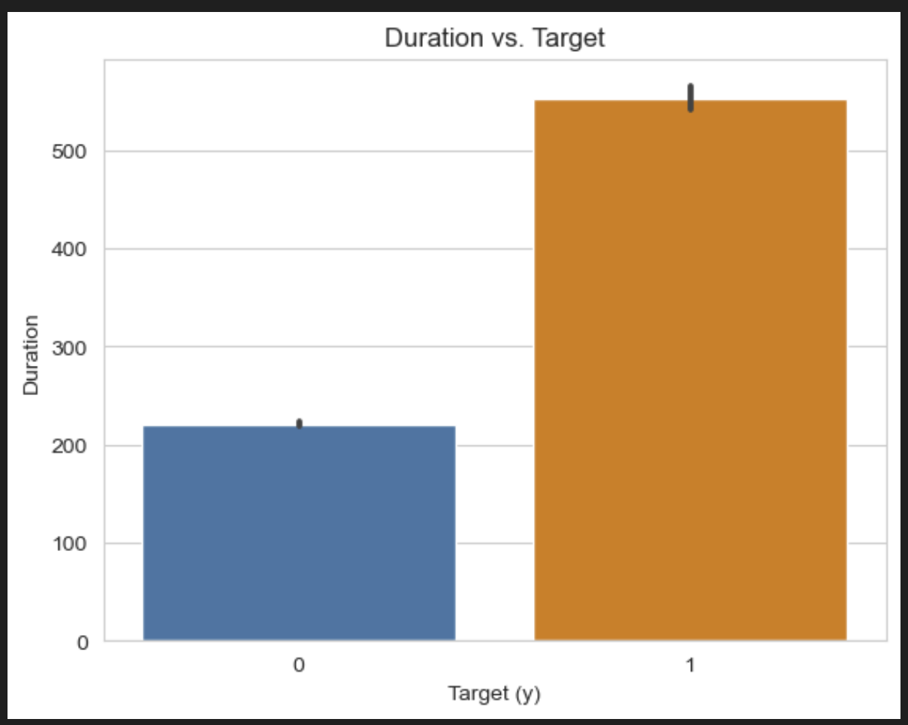

### Engineering Features

#### Encoding - OneHotEncoding

The data is encoded once using OneHotEncoding to perform a simple model and compare the performance of other classifiers.

The data is split into train and test data with 80% allocated for training and 20% for testing.

### Simple Model

A logistic regression model is constructed and evaluated:

Training Accuracy: 0.887556904400607
Testing Accuracy: 0.8865015780529255

Classification Report for Test Set:
|              |recision  |  recall | f1-score |  support|
|--------------|----------|---------|----------|----------|
|           0  |     0.89 |     1.00|      0.94|      7303|
|           1  |     1.00 |     0.00|      0.00|       935|
|    accuracy  |          |         |      0.89|      8238|
|   macro avg  |     0.94 |     0.50|      0.47|      8238|
|weighted avg  |     0.90 |     0.89|      0.83|      8238|

### Scoring and Interpretation of Results

A Logistic regression model has been trained and evaluated on the given dataset and the results are as shown above. All 20 features of the data have been used for this training purpose.

**Overall Accuracy**: Both training and testing accuracies are approximately 88.76% and 88.65% respectively, indicating reasonable performance.

**Precision, Recall, and F1-Score**: The model performs well in identifying clients not likely to subscribe ('0' class), but poorly in identifying subscribing clients ('1' class).

### Conclusion

While the logistic regression model demonstrates strong performance in identifying clients who are unlikely to subscribe to term deposits, its performance in identifying subscribing clients is poor. Further analysis and model refinement are needed to address this imbalance and improve the overall effectiveness of the predictive model.

### Model Comparisons

Four additional models (KNN, Decision Tree, SVM, and Random Forest) are trained and evaluated, with Decision Tree showing the highest accuracy.

| |Model | Train Time  |Train Accuracy | Test Accuracy|
|--|------|-------------|---------------|------------|
|0|  Logistic Regression|    0.117604  |      0.887557 |   0.886502|
|1|                  KNN|    0.020976  |      0.872382 |   0.865987|
|2|        Decision Tree|    0.068601  |      0.891472 |   0.880918|
|3|                  SVM|   44.133631  |      0.887557 |   0.886502|
|4|        Random Forest|    2.082425  |      0.891472 |   0.882010|

### Improving the model

#### Encoding - Ordinal and Label

Ordinal encoding for jobs and education, and label encoding for marital status, default status, housing, loan, and target variables are utilized to handle large categorical variables efficiently.

Additionally, only 8 significant features are chosen from the dataset, and hyperparameters for each classifier are tuned to enhance model performance.

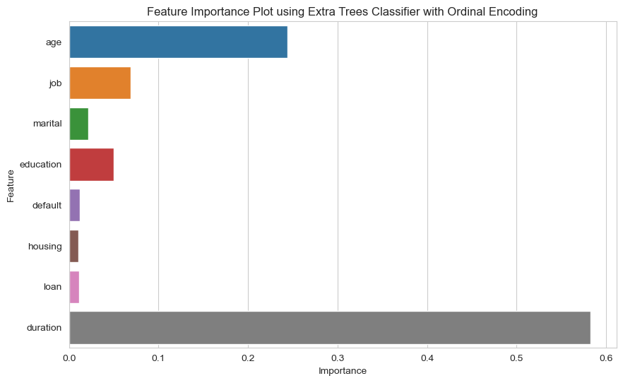

Upon observing cumulative variance using PCA analysis, we can see that all 8 columns tend to be important to get a good score. So, we are not using PCA columns for model comparison.

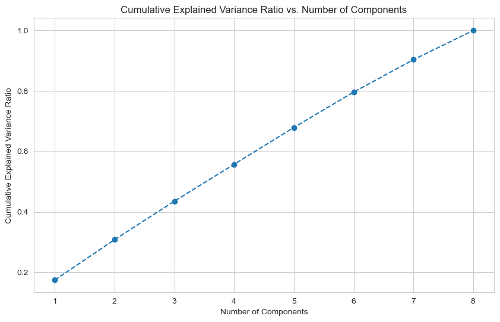

Specific hyperparameters are used for each classifier and the results obtained are as follows.

### Final Comparison Results.

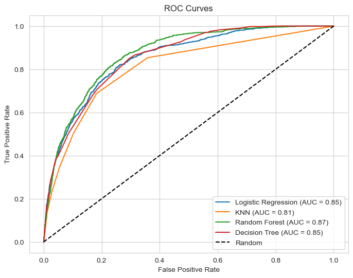

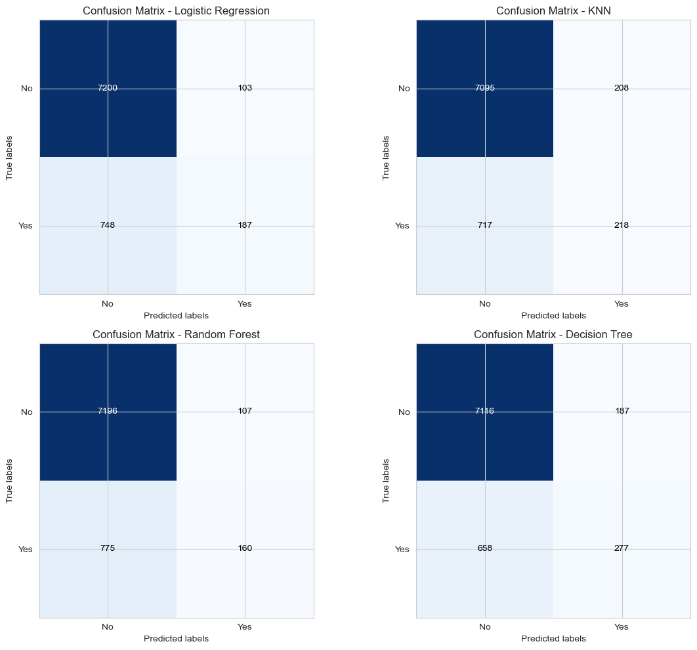

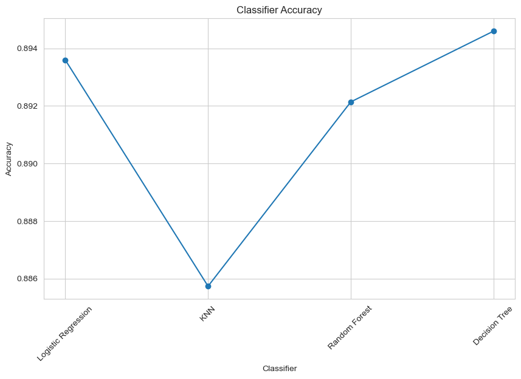

The final comparison illustrates that Decision Tree outperforms other models, while KNN exhibits the least accuracy.

## Project Conclusion

In conclusion, the Bank Campaigns Project involved analyzing a dataset from a Portuguese banking institution to predict the likelihood of clients subscribing to term deposits based on various demographic, financial, and contact-related attributes. The project utilized machine learning classifiers including logistic regression, k-nearest neighbors, decision trees, support vector machines, and random forests.

**Key Findings**:
**Imbalanced Data**: The dataset exhibited significant class imbalance, with a small proportion of clients subscribing to term deposits compared to those who did not, posing a challenge for modeling.

**Model Performance**: While the logistic regression model demonstrated strong performance in identifying clients unlikely to subscribe to term deposits, it performed poorly in identifying subscribing clients, indicating a need for further refinement and model tuning.

**Model Comparisons**: Among the models evaluated, decision trees exhibited the highest accuracy, while k-nearest neighbors performed the least effectively.

**Recommendations**: Recommendations for improving model performance include addressing imbalanced data, further feature engineering, fine-tuning model hyperparameters, and considering ensemble methods.

**Deployment**:
For deployment, we should consider developing an API for seamless integration, ensuring scalability, implementing security measures, monitoring and logging mechanisms, providing comprehensive documentation, version control, thorough testing, developing a user-friendly interface, and incorporating a feedback mechanism for iterative improvement.